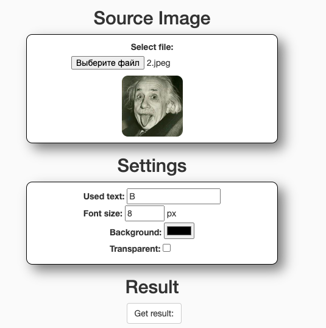
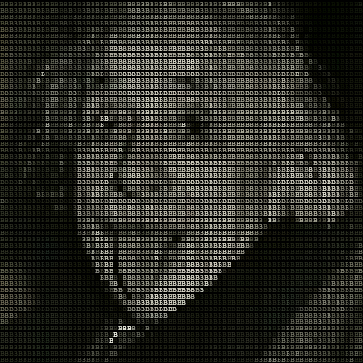

# image2ASCII

## Usage
To run the project, run the `git clone https://github.com/Pechenka2005/image2ASCII.git`
command and open the `index.html` file in the browser

## Tutorial

Upload any photo, 
set the parameters you want and click on the `resut button`. 
Your image will be converted to ASCII characters of your choice

## Result

